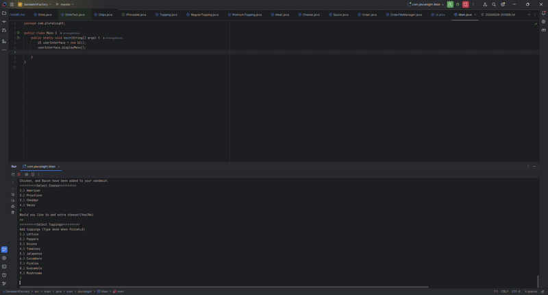

# Project Title
Sandwich Factory
## Description of the Project

This application allows user to shop at the Sandwich Factory. User can build sandwich to add to order.User can also add drink and chips to order.

## UML Class Diagram

## User Stories
- As a customer, I want to start a new order from the main menu, so that I can build a custom meal.
- As a customer, I want to cancel my order at any time, so that I don’t waste time if I change my mind.
- As a customer, I want to choose my sandwich bread and size, so that I get the exact base I want.
- As a customer, I want to add premium, regular, and sauce toppings, so that I can customize my sandwich.
- As a customer, I want to choose extra meat or cheese, so that I can upgrade my sandwich even more.
- As a customer, I want to toast my sandwich if I want, so that it’s warm and crispy.
- As a customer, I want to add a drink with a selected size, so that I can complete my meal.
- As a customer, I want to add chips of my choice, so that I get a crunchy side with my order.
- As a customer, I want to see the total price of my order with all toppings, drinks, and extras, so that I know how much I’m paying.

## Setup

- Create a new project, Project Title: Sandwich Factory
- Check create GitHub repo
- Ensure that Maven is builder
- Ensure Java 17 is language
- Click create and the add new package
- Add classes needed for the Sandwich Factory.
- Add receipts folder
### Prerequisites

- IntelliJ IDEA: Ensure you have IntelliJ IDEA installed, which you can download from [here](https://www.jetbrains.com/idea/download/).
- Java SDK: Make sure Java SDK is installed and configured in IntelliJ.

### Running the Application in IntelliJ

Follow these steps to get your application running within IntelliJ IDEA:

1. Open IntelliJ IDEA.
2. Select "Open" and navigate to the directory where you cloned or downloaded the project.
3. After the project opens, wait for IntelliJ to index the files and set up the project.
4. Find the main class with the `public static void main(String[] args)` method.
5. Right-click on the file and select 'Run 'YourMainClassName.main()'' to start the application.

## Technologies Used

- Java: 17.
- IntelliJ.
- GitHub & GitHub projects
- GitBash

## Demo

## Future Work

- Create a GUI for user to have a more aesthetic appeal.

## Resources
- Potato Sensei
- Workbook 4 - OOP in Java v2.1Y
- Workbook 5 - Inheritance v2.1Y
- Workbook 6 - Advanced OOP v2.2Y
- https://lucid.app/

## Team Members

- Emanuel Galloway Project Owner / Senior Developer

## Thanks
- Thank you to Potato Sensei & Raymond
 